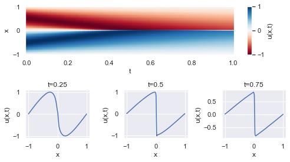
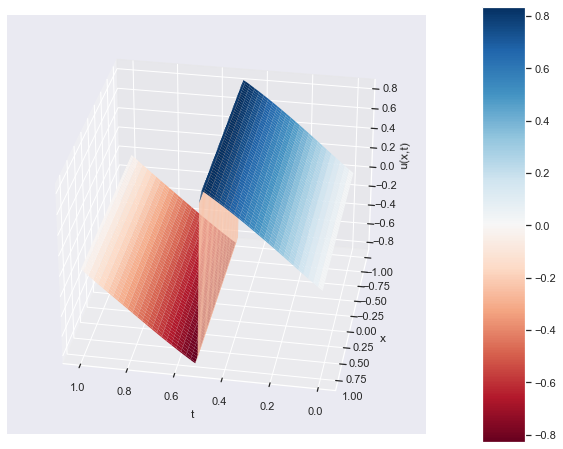

# Physics Informed Neural Network (PINN)

This repository contains Jupyter Notebook files that implement physics-informed neural networks (PINNs) using TensorFlow library. The examples in this repository are based on the paper "Physics-informed neural networks: A deep learning framework for solving forward and inverse problems involving nonlinear partial differential equations" by M. Raissi et al. (2019).

## pinn_burgers.ipynb

- pinn_burgers.ipynb: This notebook show the use of a Physics-Informed Neural Network (PINN) to solve the Burgers' equation, a nonlinear partial differential equation often found in fluid mechanics. The notebook offers a comprehensive, step-by-step guide to the code implementation. To promote flexibility and ease of understanding, I have made an effort to design the code using a modular approach, which facilitates seamless adaptation to other problems.

  **PINN: One-Dimensional Burger Equation**
  
  The Burgers' equation is a fundamental partial differential equation (PDE) that arises in various areas of applied mathematics, such as fluid mechanics, nonlinear acoustics, and gas dynamics. The equation describes the evolution of a scalar field (like velocity, temperature, or density) that experiences both nonlinear convection and diffusion.

  In its one-dimensional, unsteady, and inviscid form, the Burgers' equation is given by:

  $$\frac{\partial u}{\partial t} + u \frac{\partial u}{\partial x} = \nu \frac{\partial^2 u}{\partial x^2}$$

  Here, u(x, t) is the dependent variable (e.g., velocity), x is the spatial variable, t is the time variable, and ν is the kinematic viscosity coefficient. The first term on the left-hand side represents the time evolution, the second term represents the nonlinear convection, and the term on the right-hand side represents the diffusion or dissipation.

  In the specific case considered in the provided code, the Burgers' equation is solved with the following conditions:

  - **Domain**: The spatial domain is $x \in [1,-1]$, and the time domain is $t \in [0,1]$, the problem is being solved within this rectangular domain.
  - **Initial Condition**: $u(0, x) = -\sin(\pi x)$ where $x \in [-1, 1]$. This describes the initial state of the dependent variable $u(x, t)$ at time $t = 0$.
  - **Boundary conditions**:u(t, -1) = u(t, 1) = 0, where $t \in [0,1]$. These conditions enforce that the dependent variable $u(x, t)$ is equal to zero at the boundaries $x = -1$ and $x = 1$ for all times t.
 
The goal is to train a physics-informed neural network (PINN) to approximate the solution $u(x, t)$ of the Burgers' equation under these conditions. The PINN is trained to minimize the residuals of the PDE, initial conditions, and boundary conditions by using randomly sampled points within the domain and points satisfying the initial and boundary conditions.

### Results

**2D Colormap of u(x, t)**

This 2D colormap visualizes the evolution of the dependent variable $u(x, t)$ over time (x-axis) and space (y-axis). The color intensity represents the magnitude of $u(x, t)$, with different colors illustrating different magnitudes.

**3D Surface of u(x, t)**

The 3D surface plot provides a different perspective of the solution $u(x, t)$, where the z-axis represents the magnitude of $u(x, t)$. The surface plot allows for better visualization of the behavior of the dependent variable throughout the spatial and temporal domain, offering a more comprehensive understanding of the Burgers' equation solution.

## References
1. Raissi, M., Perdikaris, P., & Karniadakis, G. E. (2019). Physics-informed neural networks: A deep learning framework for solving forward and inverse problems involving nonlinear partial differential equations. Journal of Computational Physics, 378, 686-707. doi:10.1016/j.jcp.2018.10.045
